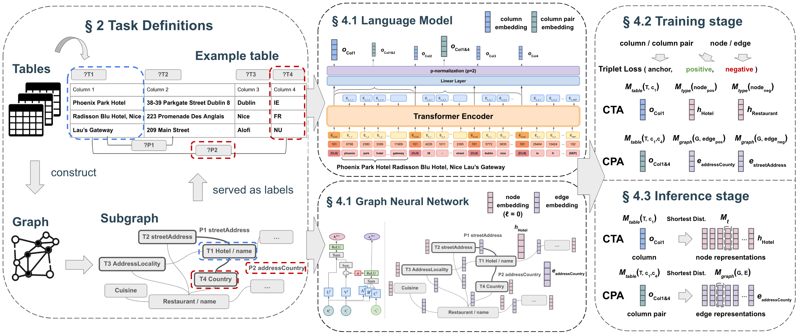

# RODEO

The official repository for the paper **"Label-Constrained Column Annotation with Language Models and Graph Neural Networks"**, accepted at the **42nd IEEE International Conference on Data Engineering (ICDE 2026)**.

<p align="center">
  
</p>

RODEO is a two-tower architecture that integrates a language model and a graph neural network (GNN) to jointly model tables and their semantic label space for column annotation. It reformulates Column Type Annotation (CTA) and Column Property Annotation (CPA) from classification to matching problems, aligning column embeddings with node/edge embeddings in a schema graph via triplet loss with an online negative mining strategy. RODEO can effectively handle annotating numerical columns and learning under data scarcity, and we find that adding the graph constraints consistently leads to better performance.

## Features

- **Graph as label space**: constructs one schema graph per dataset from the annotation schema, where semantic types are nodes and properties are edges, providing structural label constraints within and across tables during training.
- **Two-tower contrastive learning**: jointly trains a language model (table encoder) and a graph neural network (label encoder) end-to-end to align column embeddings with graph node/edge embeddings via triplet loss.
- **Unified negative mining strategy**: balances semi-hard and hardest negatives with a configurable ratio σ, improving training stability and convergence over using either strategy alone.
- **Scalable table encoder**: encoder-agnostic framework that scales up the language model backbone from BERT-like models to the Qwen3 Embedding series (0.6B, 4B, 8B).
- **Sub-table sampling**: adopts the sampling strategy from TorchicTab to handle large tables that exceed the input length limit of language models, by randomly sampling a subset of rows and columns per training iteration.

## Repository Structure
```
RODEO/
├── config/            # JSON configuration files for all experiments
├── graph/             # Scripts for constructing schema graphs (SPO triples) from annotations
├── inference/         # Inference scripts for different model variants
├── layers/            # Neural backbone implementations (BERT, Qwen3, GatedGCN)
├── loaders/           # PyTorch dataset and DGL graph loaders
├── tokenizers/        # Table serialization and tokenization scripts
├── train/             # Training scripts, loss functions, and negative mining
├── triples/           # Pre-constructed SPO triple files for each dataset graph
├── utils/             # Shared utility functions
├── visuals/           # Heatmap and t-SNE embedding visualization scripts
├── conda_env.yml      # Conda environment specification
└── pyproject.toml     # Python package configuration
```

## Environment Setup

**Create the conda environment**
```bash
conda config --set solver libmamba
conda env create -f conda_env.yml
conda activate <env_name>
```

> **Note:** Update the `name` and `prefix` fields in `conda_env.yml`.

**Install Deep Graph Library (DGL)**
```bash
pip install dgl==2.4.0 -f https://data.dgl.ai/wheels/torch-2.4/cu121/repo.html
```

**Install RODEO local modules**
```bash
pip install -e .
```

## Dataset Preparation

The scripts under `tokenizers/` serialize raw tables into token IDs and process annotation files, saving both as pickle files so they can be loaded directly during training.

Examples:
```bash
# BERT-style tokenization for SOTAB
python tokenizers/sotab2tokens.py

# Qwen-style tokenization for SOTAB
python tokenizers/sotab2tokens_qwen.py
```

> **Note:** Pre-generated pickle files are available on [Zenodo](https://zenodo.org/records/18944841) and can be used directly to skip the tokenization step.

## Graph Construction

The scripts under `graph/` generate SPO triples from dataset annotation files. The preprocessing of annotation files may differ across datasets, but the core graph construction procedure follows Algorithm 2 in the paper.

Example:
```bash
python graph/build_pg_sotab_dbpedia.py
```
The same semantic property may be assigned to multiple edges in the graph, as a property can appear across different type pairs. Since each edge is bound to a specific subject type and object type, or is unique under a topic, a mapping from the property to the right edge is created in the graph loader `loaders/pt_graph.py`. 
During training and inference, the graph loader `loaders/pt_graph.py` builds DGL graphs from these triples by loading functions under `graph/`.

## Training

All experiments are controlled by the corresponding JSON configuration file under `config/`, passed via `--load_json`. Configuration files define dataset paths, model variant, negative mining strategy, GNN depth, optimization parameters, and model save paths. LoRA settings are specified in the configuration file for Qwen3 Embedding training.
For most experiments, we use 40 training epochs in the paper, but recommend adjusting this based on your dataset with training accuracy reaching at least 99% to prevent underfitting.

Examples:
```bash
python train/train_sotab_triplet_loss_gnn.py --load_json config/setting_sotab_rodeo_gnn.json

# with Qwen3 Embeddings and LoRA
python train/train_sotab_triplet_loss_gnn_llm.py --load_json config/setting_sotab_rodeo_gnn_llm.json
```

> **Note:** Update the folder paths in the configuration files, and check out `loaders/load_dataset.py` for loading the pickle files.

## Inference

Load a trained checkpoint and produce CTA/CPA predictions.

Examples:
```bash
python inference/inference_gnn.py --load_json config/setting_sotab_rodeo_gnn.json

# with Qwen3 Embeddings
python inference/inference_gnn_llm.py --load_json config/setting_sotab_rodeo_gnn_llm.json
```

## Citation

If you find this work useful, please cite:
```bibtex
@inproceedings{yang2026rodeo,
  title={Label-Constrained Column Annotation with Language Models and Graph Neural Networks},
  author={Yang, Duo and Dasoulas, Ioannis and Dimou, Anastasia},
  booktitle={2026 IEEE 42nd International Conference on Data Engineering (ICDE)},
  year={2026},
  address={Montr\'{e}al, Canada},
  month={May}
}
```
